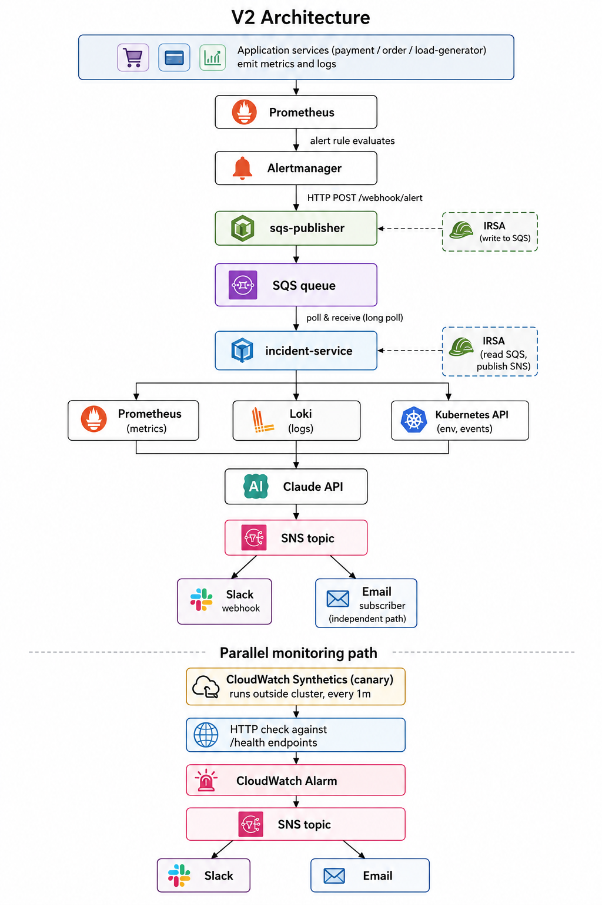

# Kubernetes Incident Response Platform

An AI-powered incident response system on Amazon EKS that detects production failures, gathers context across metrics and logs, generates a structured root cause analysis using Claude, and posts the diagnosis to Slack within seconds of an alert firing.

This repository is a portfolio project that demonstrates end-to-end cloud-native engineering: infrastructure-as-code, GitOps, observability, alerting, and an LLM integration that turns raw alert metadata into actionable triage steps.

## What it does

When a microservice in the cluster starts misbehaving (elevated 5xx error rate, increased latency, pod restart loop), the platform:

1. Detects the failure via Prometheus alert rules.
2. Receives the alert through Alertmanager and forwards it to a custom incident-service webhook running in the cluster.
3. Gathers context in parallel by querying Prometheus for recent metrics (error rate, request rate, p95 latency) and Loki for the last five minutes of error and warning logs from the affected service.
4. Calls the Anthropic Claude API with a structured prompt containing the alert metadata, metrics, and log excerpts.
5. Parses the response and posts a formatted message to a Slack channel with the root cause, confidence level, and a list of recommended actions an on-call engineer can take immediately.

End-to-end latency from alert firing to Slack message is typically under ten seconds.

## Architecture


<p align="center">
  
</p>


GitOps via ArgoCD watches the `gitops/` folder in this repository. Every change to a microservice manifest, alert rule, or Application definition is reconciled into the cluster automatically. Direct `kubectl apply` is reserved for cluster bootstrap and read-only debugging.

## Technology stack

Infrastructure is provisioned with Terraform: a VPC with public and private subnets across two availability zones, an EKS cluster running Kubernetes 1.31 on Spot-priced t3.medium nodes, ECR repositories for application images, and IAM roles for IRSA. Remote state is stored in S3 with native state locking via `use_lockfile`.

The cluster runs ArgoCD for GitOps, kube-prometheus-stack for metrics and alerting, Loki with Promtail for log aggregation, and the EBS CSI driver for persistent volume provisioning. All three observability components are installed via Helm with sized resource requests and limits to fit within the t3.medium pod-per-node budget.

Application services are written in Python with FastAPI and instrumented with prometheus-fastapi-instrumentator. The incident-service additionally uses httpx for async HTTP calls to Prometheus, Loki, and Slack, and the official Anthropic Python SDK for the Claude API.

## Repository layout

```
kubernetes-incident-platform/
├── apps/
│   ├── payment-service/          FastAPI service with FAILURE_MODE injection
│   ├── order-service/            FastAPI service that calls payment-service
│   ├── load-generator/           Continuous traffic at 5 req/s
│   └── incident-service/         Webhook receiver + AI analysis + Slack output
├── gitops/
│   ├── apps/
│   │   ├── payment-service/      Deployment, Service, ServiceMonitor
│   │   ├── order-service/        Deployment, Service, ServiceMonitor
│   │   ├── load-generator/       Deployment
│   │   ├── incident-service/     Deployment, Service, ServiceMonitor
│   │   ├── alert-rules/          PrometheusRule objects (6 alerts total)
│   │   └── nginx-demo/           Sanity-check workload
│   └── argocd-apps/              ArgoCD Application definitions
├── terraform/
│   └── environments/dev/         VPC + EKS + ECR + IAM
└── docs/                         Architecture diagrams and notes
```

## Setup

Prerequisites: AWS account with sufficient quota for EKS, Terraform 1.5+, kubectl, helm, docker, an Anthropic API key, and a Slack workspace with permission to create incoming webhooks. The setup below assumes you are working from a Linux or macOS environment, or Git Bash on Windows.

### 1. Provision infrastructure

```
cd terraform/environments/dev
terraform init
terraform plan -out=tfplan.binary
terraform apply tfplan.binary
```

This provisions the VPC, EKS cluster, ECR repositories, and IAM roles. Expect fifteen to eighteen minutes.

Wire kubectl to the new cluster:

```
aws eks update-kubeconfig --region us-east-1 --name incident-platform-dev-cluster
kubectl get nodes
```

### 2. Install the EBS CSI driver

EKS clusters created after 2023 do not ship with a working EBS provisioner; the in-tree provisioner has been removed in Kubernetes 1.31. Install the addon and bind an IAM role that grants the controller permission to create EBS volumes.

```
NEW_OIDC=$(aws eks describe-cluster --name incident-platform-dev-cluster \
  --query 'cluster.identity.oidc.issuer' --output text | sed 's|https://||')

cat > /tmp/csi-trust-policy.json <<EOF
{
  "Version": "2012-10-17",
  "Statement": [
    {
      "Effect": "Allow",
      "Principal": { "Federated": "arn:aws:iam::ACCOUNT_ID:oidc-provider/${NEW_OIDC}" },
      "Action": "sts:AssumeRoleWithWebIdentity",
      "Condition": {
        "StringEquals": {
          "${NEW_OIDC}:sub": "system:serviceaccount:kube-system:ebs-csi-controller-sa",
          "${NEW_OIDC}:aud": "sts.amazonaws.com"
        }
      }
    }
  ]
}
EOF

aws iam create-role --role-name AmazonEKS_EBS_CSI_DriverRole \
  --assume-role-policy-document file:///tmp/csi-trust-policy.json

aws iam attach-role-policy --role-name AmazonEKS_EBS_CSI_DriverRole \
  --policy-arn arn:aws:iam::aws:policy/service-role/AmazonEBSCSIDriverPolicy

aws eks create-addon --cluster-name incident-platform-dev-cluster \
  --addon-name aws-ebs-csi-driver \
  --service-account-role-arn arn:aws:iam::ACCOUNT_ID:role/AmazonEKS_EBS_CSI_DriverRole

kubectl patch storageclass gp2 -p \
  '{"metadata": {"annotations":{"storageclass.kubernetes.io/is-default-class":"true"}}}'
```

Replace `ACCOUNT_ID` with your AWS account number.

### 3. Install the observability stack

Install Prometheus, Grafana, Alertmanager, Loki, and Promtail. The order matters: Prometheus stack installs the `ServiceMonitor` and `PrometheusRule` CRDs that the application manifests reference. Installing ArgoCD apps before these CRDs exist causes sync failures.

```
helm repo add prometheus-community https://prometheus-community.github.io/helm-charts
helm repo add grafana https://grafana.github.io/helm-charts
helm repo update

kubectl create namespace monitoring

helm install kube-prometheus-stack prometheus-community/kube-prometheus-stack \
  --namespace monitoring --version 65.5.0 \
  --set prometheus.prometheusSpec.resources.requests.memory=400Mi \
  --set prometheus.prometheusSpec.resources.limits.memory=800Mi \
  --set prometheus.prometheusSpec.retention=2d \
  --set grafana.adminPassword=admin

helm install loki grafana/loki --namespace monitoring --version 6.16.0 \
  --set deploymentMode=SingleBinary \
  --set loki.auth_enabled=false \
  --set singleBinary.replicas=1 \
  --set singleBinary.persistence.enabled=true \
  --set singleBinary.persistence.size=5Gi \
  --set backend.replicas=0 --set read.replicas=0 --set write.replicas=0 \
  --set gateway.enabled=false

helm install promtail grafana/promtail --namespace monitoring --version 6.16.6 \
  --set "config.clients[0].url=http://loki:3100/loki/api/v1/push" \
  --set "tolerations[0].operator=Exists"
```

### 4. Install ArgoCD and bootstrap the Applications

```
helm repo add argo https://argoproj.github.io/argo-helm
helm repo update

kubectl create namespace argocd
helm install argocd argo/argo-cd --namespace argocd --version 7.7.0 \
  --set server.service.type=ClusterIP \
  --set dex.enabled=false

kubectl apply -f gitops/argocd-apps/
```

Wait sixty to ninety seconds for ArgoCD to reconcile, then verify:

```
kubectl get application -n argocd
```

All applications should report `Synced` and `Healthy`.

### 5. Configure Alertmanager to route to incident-service

The default kube-prometheus-stack ships an Alertmanager configuration that routes every alert to a null receiver. Replace it with a webhook config that forwards real alerts to the incident-service.

```
kubectl apply -f - <<EOF
apiVersion: v1
kind: Secret
metadata:
  name: alertmanager-kube-prometheus-stack-alertmanager
  namespace: monitoring
stringData:
  alertmanager.yaml: |
    global:
      resolve_timeout: 5m
    route:
      group_by: ['alertname', 'service']
      group_wait: 10s
      group_interval: 30s
      repeat_interval: 1h
      receiver: 'incident-service'
      routes:
        - matchers: [alertname = "Watchdog"]
          receiver: 'null'
        - matchers: [alertname = "InfoInhibitor"]
          receiver: 'null'
    receivers:
      - name: 'null'
      - name: 'incident-service'
        webhook_configs:
          - url: 'http://incident-service.default.svc.cluster.local/webhook/alert'
            send_resolved: true
EOF

kubectl rollout restart statefulset/alertmanager-kube-prometheus-stack-alertmanager -n monitoring
```

The Alertmanager pod restarts and picks up the new routing.

### 6. Provide secrets to the incident-service

The incident-service needs an Anthropic API key and a Slack webhook URL. For a development setup these are stored as a Kubernetes Secret in the default namespace; a production deployment would use AWS Secrets Manager with IRSA (see "Known limitations and what I would do differently" below).

Place the values in files first to avoid leaking them into shell history or screenshots:

```
printf '%s' "$ANTHROPIC_API_KEY" > /tmp/anthropic-key.txt
printf '%s' "$SLACK_WEBHOOK_URL" > /tmp/slack-url.txt

kubectl create secret generic incident-service-secrets \
  --namespace=default \
  --from-file=ANTHROPIC_API_KEY=/tmp/anthropic-key.txt \
  --from-file=SLACK_WEBHOOK_URL=/tmp/slack-url.txt

rm /tmp/anthropic-key.txt /tmp/slack-url.txt
```

### 7. Verify end-to-end

Trigger a real incident by enabling failure mode in payment-service via git:

```
sed -i 's/value: "none"/value: "errors"/' gitops/apps/payment-service/deployment.yaml
git add gitops/apps/payment-service/deployment.yaml
git commit -m "test: enable FAILURE_MODE=errors"
git push
```

ArgoCD picks up the change within thirty seconds and rolls a new payment-service pod that returns 500s on thirty percent of requests. After roughly two minutes of sustained errors (matching the `for: 2m` window in the alert rule), `PaymentServiceHighErrorRate` fires. Alertmanager forwards it to incident-service, which gathers context and posts the analysis to Slack.

Restore normal behavior by reverting:

```
sed -i 's/value: "errors"/value: "none"/' gitops/apps/payment-service/deployment.yaml
git add gitops/apps/payment-service/deployment.yaml
git commit -m "restore: payment-service back to normal"
git push
```

## Key design decisions

**Why Prometheus + Loki and not just one?** Metrics tell you what is wrong: the error rate is elevated, latency is climbing, requests are failing. Logs tell you why: the exception trace, the configuration value, the downstream service that returned a malformed response. Giving Claude both signals produces materially better root cause analyses than either alone. The smoke test with empty context produced generic responses; the real test with metrics plus twenty log lines produced specific, actionable recommendations.

**Why a custom webhook service instead of Alertmanager's built-in Slack integration?** Alertmanager can post alerts to Slack natively, but only as raw alert text. The whole point of this project is the analysis layer between alert and human: gathering context, calling the LLM, and producing a structured triage message. That requires custom code, and a webhook receiver inside the cluster is the cleanest place for it.

**Why GitOps with ArgoCD instead of `kubectl apply` in CI?** Every change to running state is a git commit. The cluster's state at any moment is determined by what is in the `gitops/` folder of the repository. This catches a class of bugs where someone applies a change locally, forgets to commit, and the cluster diverges from the source of truth. It also makes rollback trivial: revert the commit and ArgoCD reverts the cluster.

**Why deduplicate alerts in the incident-service?** Alertmanager groups alerts and resends them on its `group_interval` (thirty seconds in this setup). Without deduplication, a single sustained incident would burn Claude API credits and spam Slack every thirty seconds. The incident-service caches alert-and-minute keys in memory and ignores duplicates inside the same minute window.

**Why filter out resolved alerts?** When `FAILURE_MODE` is reverted, Alertmanager sends a `resolved` status notification with `send_resolved: true`. Sending these to Claude wastes credits because there is nothing to diagnose; the system is fine again. The webhook handler skips alerts with `status == "resolved"` before calling Claude.

## Cost discipline

The cluster is destroyed and recreated nightly. Monthly spend stays under twenty dollars in development. Spot-priced t3.medium nodes, a single NAT gateway, Loki with a 5Gi EBS volume, and a two-day Prometheus retention window keep costs predictable. The Anthropic API costs roughly a cent per analysis with Claude Haiku.

The bootstrap sequence above takes thirty to forty minutes from `terraform apply` to first Slack message. Once familiar with it, a full daily cycle (apply, develop, test, destroy) fits inside three hours.

## Known limitations and what I would do differently

The Anthropic API key and Slack webhook URL are stored as a Kubernetes Secret in the cluster. A production deployment would store them in AWS Secrets Manager and grant the incident-service permission to read them via IRSA. This adds about thirty minutes of setup (IAM role, OIDC trust policy, service account binding) and a small amount of code to fetch the secret at startup, but it gains audit logging, rotation, and proper encryption at rest. The current setup is documented as a deliberate scope decision.

The kube-prometheus-stack ships several alerts that fire on every EKS cluster because AWS does not expose the metrics endpoint for the control plane components it manages. `KubeSchedulerDown` and `KubeControllerManagerDown` are two examples. In a real deployment these would be silenced via Alertmanager inhibit rules or disabled in the Helm values. They are left enabled here to demonstrate that the platform handles unfamiliar alert names gracefully.

The Alertmanager configuration lives in a `kubectl apply`-d secret rather than in the Helm values. Reinstalling the Prometheus stack overwrites the secret with defaults and the custom routing is lost until it is reapplied. The proper fix is to configure Alertmanager via the chart's `alertmanager.config` block in a values file.

The dedup cache in incident-service is in-memory and disappears on pod restart. A production deployment would back this with Redis or a small relational store, also useful for an incident history view.

The `ServiceMonitor` for kube-scheduler and kube-controller-manager would be disabled in a real cluster to silence the false-positive alerts described above. They are kept here so the incident-service can be observed handling a variety of alert sources.

## What I learned

The biggest lesson was about ordering. EKS does not include the EBS CSI driver, so PersistentVolumeClaims hang silently until the addon is installed. Helm charts that ship CRDs must run before ArgoCD applications that reference those CRDs. Custom Alertmanager configuration must be reapplied after every `helm install`, because Helm resets the secret to chart defaults. Each of these is obvious in hindsight but surprising on first encounter, and each is the sort of detail an interviewer asks about.

The second lesson was about secret hygiene. Early in this project an API key was typed into a shell that was visible in a screenshot. The key was rotated within minutes, and the incident became a useful habit: secrets are loaded from files via `--from-file`, never typed inline, never echoed, never committed. The same applies to the Slack webhook URL.

The third lesson was about LLM integration as an engineering discipline rather than a magic ingredient. Claude's first responses, given only the alert text, were generic. Adding Prometheus metrics changed the responses to be quantitatively grounded. Adding Loki log lines changed them again, this time to reference specific error patterns from the logs. Each layer of context produced a measurably better answer. The prompt itself is short and structured: alert metadata, metrics block, log block, and a required output format with root cause, confidence, and recommended actions. The model fills in the rest reliably.

## License

This project is provided as a portfolio sample. The infrastructure code, application code, and manifests are free to use and adapt. The Anthropic API and Slack webhook keys are your responsibility; do not commit them to any repository.
